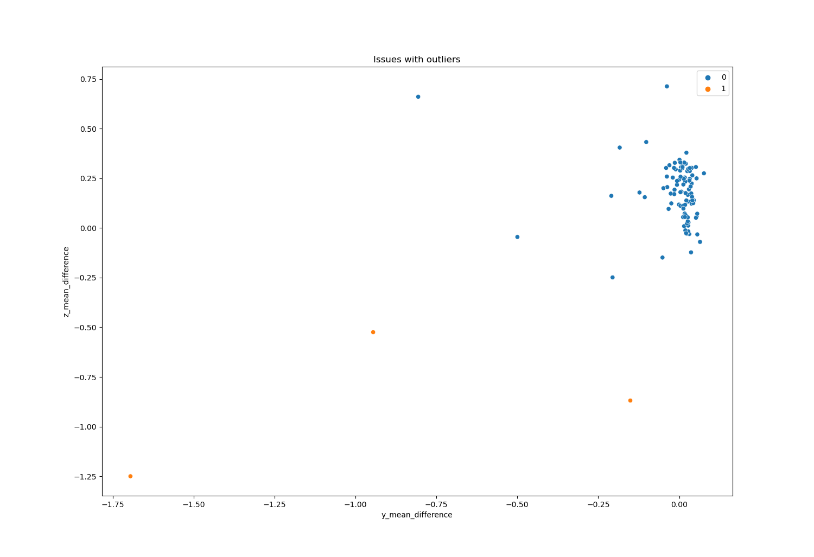
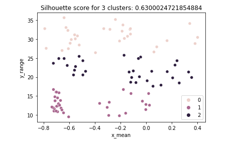
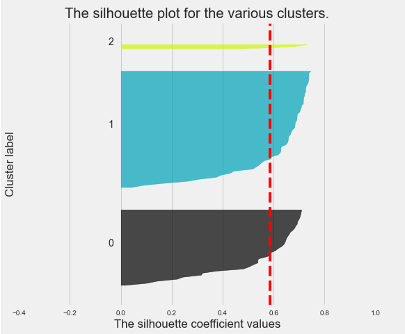
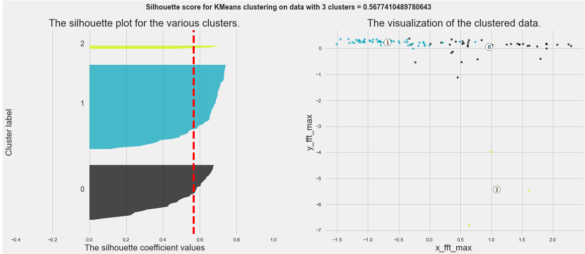
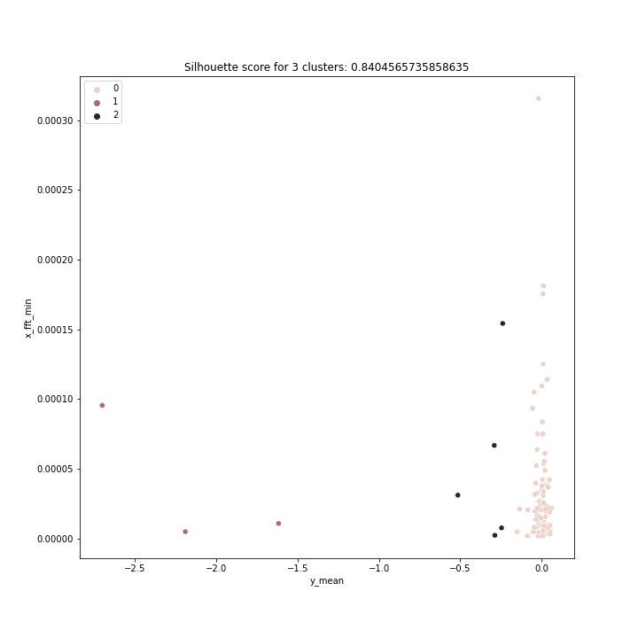

### challenge-clustering
# Description
This was a solo project during my education at BeCode. 
The goal was to get more familiar with different clustering algorithms and their evaluation methods. For this assignment we had to use a dataset from <a href="https://www.kaggle.com/isaienkov/bearing-classification" target="_blank">Kaggle</a>. 

# Goals
* Get more familiar with different clustering algorithms
* Learn how to handle different cluster evalution methods.
* Learn how to compare different cluster algorithms to each other.
* Gain more knowledge on fft and how it can be used.

NOTE:
In the past I had already worked on this dataset, so the data had already been cleaned and preprocessed to apply clustering.

# Installation
## Python version
* Python 3.9

## Packages used
* pandas
* numpy
* matplotlib.pyplot
* seaborn
* sklearn
* plotly
* itertools
* yellowbrick

## Databases
Github has a 100MB file limit, so the original .csv files can't be found in this repository.  
Below however, you can find the links to both original files.
* <a href="https://www.kaggle.com/isaienkov/bearing-classification?select=bearing_classes.csv" target="_blank">Target</a>
* <a href="https://www.kaggle.com/isaienkov/bearing-classification?select=bearing_signals.csv" target="_blank">Features</a>

# Usage
| File                               | Description                                                                            |
|------------------------------------|----------------------------------------------------------------------------------------|
| Feature_engineering_csv.py         | File containing Python code. Makes a .csv file to put into different clustering algorithms. |
| Clustering_KMeans.ipynb            | Jupyter Notebook containing Python code.    Contains all my progress on day1-2      |
| Functions.py                       | File containing Python code.   Functions I will be using in the future, when handling clustering. |
| Clustering_Kmeans_2_features.ipynb | File containing Python code.   Looked for a second time, now using functions, for the best 2 features for clustering. |
| bearing_clustering_assignment.md   | File containing the assignment details, as given to us by BeCode.                      |
| Visuals                            | Folder containing interesting plots, used to gain insight in the features.             |
| Python_files                       | Folder containing Python code.   Used this code from another group to get a .csv with 39 features. |
| CSV                                | Folder containing .csv files used in this project.                                     |
| clustering_ready.csv               | .csv file used for clustering.                                                         |
| Feature_engineered.csv             | .csv file already preprocessed and with added features, from a previous assignment.    |

# Step by step explanation of how I handled the project.
## 1. Finding the "best" features
Plotting faulty bearings against good bearings to see if these were good features to keep for clustering.

## 2. Using Kmeans on two features, plotting the highest scores.
Eventually I wrote a for-loop that went over 2-6 clusters and looped over every possible combination of 2 features.  
When plotting the highest scores, I noticed that the outliers were causing my clusters to divide real badly.

## 3. Using Kmeans on two features, plotting everything.
I abandoned my first route, and went on a search for the best score, while having an acceptable distribution between clusters.  
I ended up on these two features: "x_mean", "y_range"

## 4. Using Kmeans on 3 features, plotting everything.
I continued along this route and came up with this:

| Parameter          | Values                       |
|--------------------|------------------------------|
| Feature columns    | y_mean, x_fft_max ,y_fft_max |
| Silhouette_score   | 0.59                         |
| Number of clusters | 3                            |

## 5. Using Kmeans on 4 features, plotting everything.
| Parameter          | Values                                |
|--------------------|---------------------------------------|
| Feature columns    | x_fft_max, y_mean, y_fft_max, y_range |
| Silhouette_score   | 0.56                                  |
| Number of clusters | 3                                     |

## 6. Making functions to automate as much as possible.
I realised that the way I was doing all the steps before, required a lot of me, looking at plots. 
I wrote down exactly what I was searching for in the plots every time, and how I could make it clear to the computer what that was.
1. Combinations of features.
2. Kmeans of every feature-combination (PARAM: List)
    * With range(x) amount of clusters (PARAM: Int)
3. Single data point silhouette score never below x (PARAM: float)
4. Total silhouette scores only above x (PARAM: float)
5. Min datapoints x in every cluster. (PARAM: int)

## 7. I managed to automate the process.
| Parameter          | Values          |
|--------------------|-----------------|
| Feature columns    | y_mean, x_fft_mean |
| Silhouette_score   | 0.84            |
| Number of clusters | 3               |

# Contributor
| Name          | Github                           |
|---------------|----------------------------------|
| Matthew Samyn | https://github.com/matthew-samyn |

# Honorable mention
The dataset I used was already preprocessed and feature engineered in a previous group assignment.  
<a href="https://github.com/Helabrak/challenge-classification" target="_blank">Link to their Github repository</a>  
  
These were the group members that did this:

| Name             | GitHub                                          |
|------------------|-------------------------------------------------|
| Heba Elebrak     | <a href="https://github.com/Helabrak">https://github.com/Helabrak       |
| Leonord Drummond | <a href="https://github.com/ltadrummond">https://github.com/ltadrummond |
| Michel Ombessa   | <a href="https://github.com/mdifils">https://github.com/mdifils         |
| Logan Vendrix    | <a href="https://github.com/lvendrix">https://github.com/lvendrix       |

# Timeline
09.08.2021 - 11.08.2021